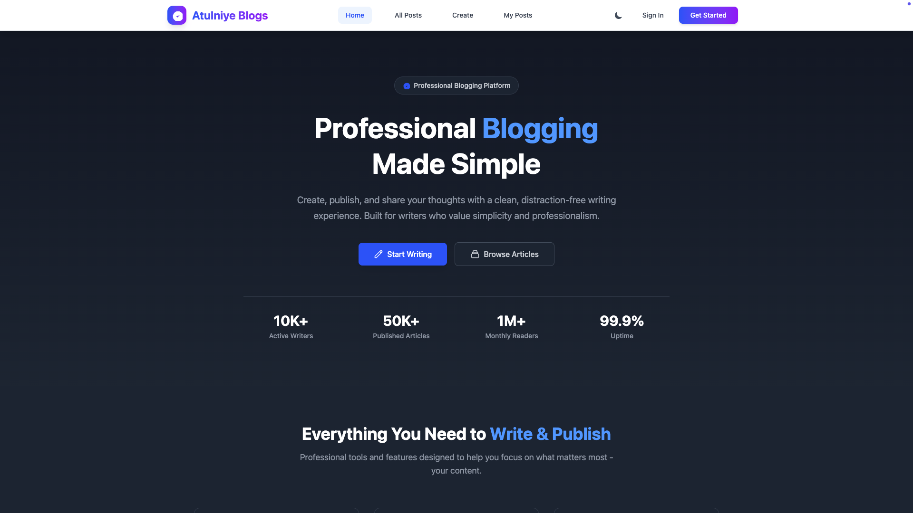
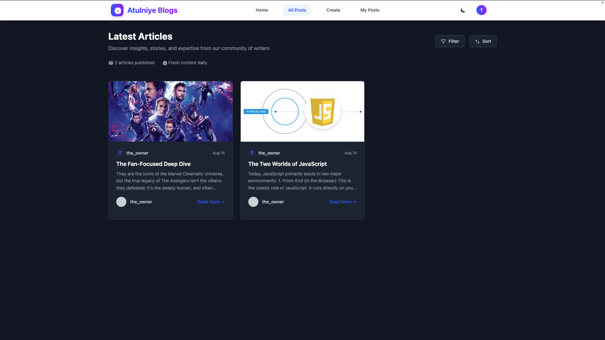
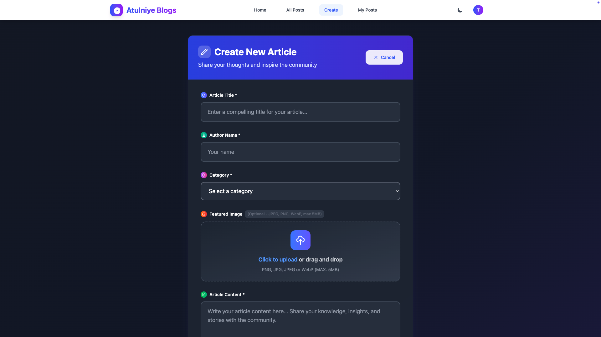
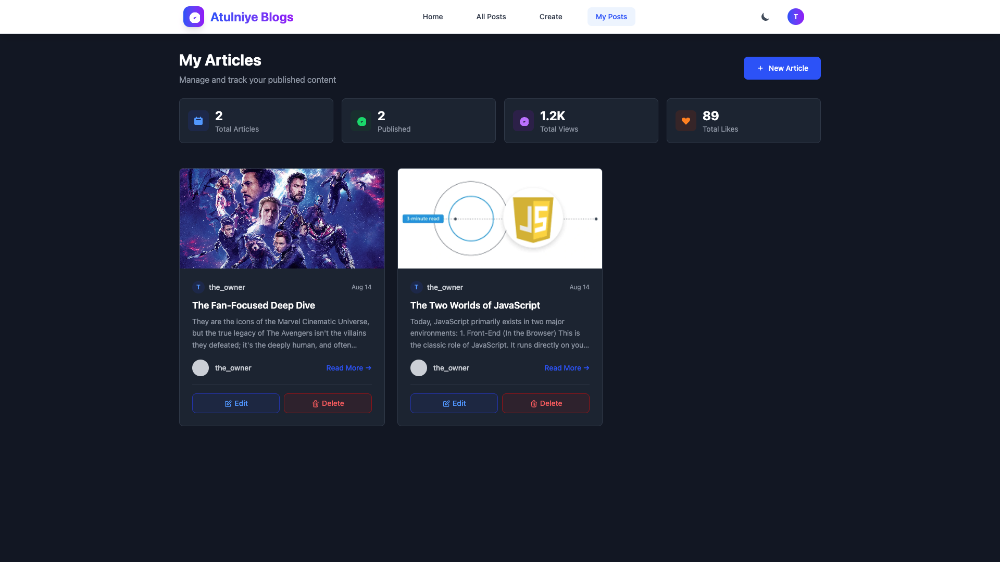
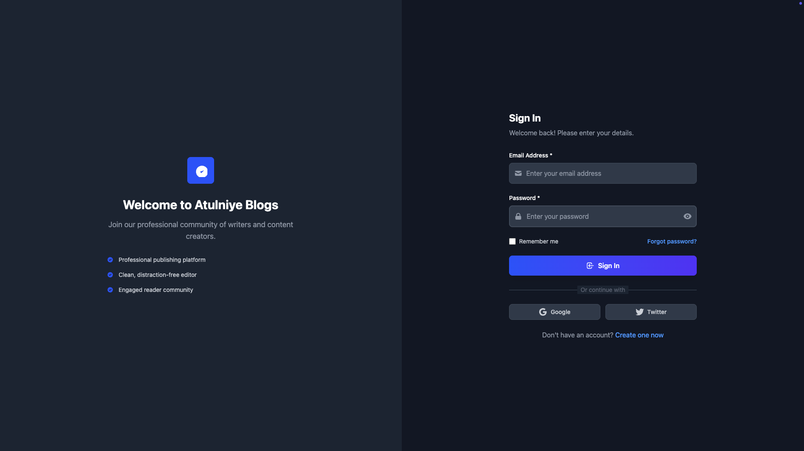
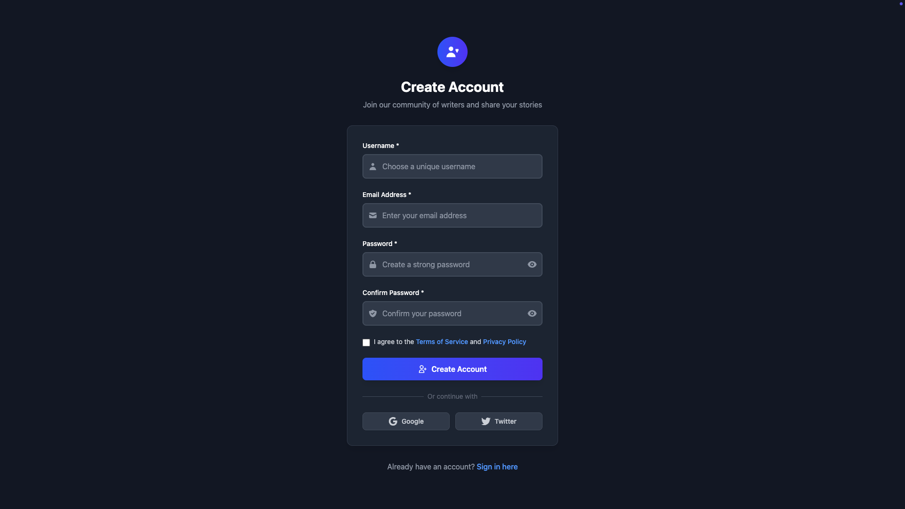
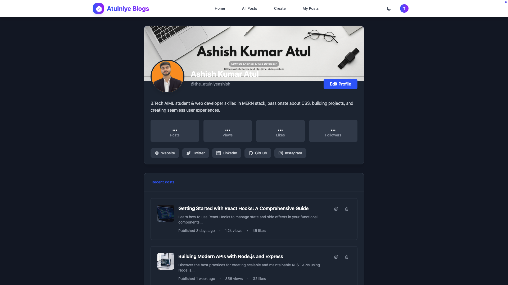

# Atulniye Blogs Backend

A modern, full-stack blogging platform built with the MERN stack (MongoDB, Express, React, Node.js).

## 🚀 Features
- User authentication (register, login, logout, session-based)
- Edit profile with avatar upload (Multer, MongoDB Buffer storage)
- Glassmorphism-inspired UI (React + Tailwind CSS)
- Create, edit, and delete blog posts
- Social links and bio for each user
- Responsive and mobile-friendly design
- RESTful API endpoints

## 🏗️ Project Structure

```
Atulniye Blogs Backend/
├── client/                # React frontend
│   ├── src/
│   │   ├── pages/         # Main React pages (EditProfile, MyProfile, etc.)
│   │   ├── components/    # Reusable UI components
│   │   └── ...
│   ├── public/            # Static assets
│   └── ...
├── models/                # Mongoose models (User, Blog)
├── routes/                # Express route handlers (authRoutes, blogRoutes)
├── server.js              # Express app entry point
├── package.json           # Backend dependencies
└── README.md              # Project documentation
```

## ⚙️ Setup & Installation

1. **Clone the repository:**
   ```bash
   git clone https://github.com/Ashish-Kumar-Atul/Atulniye-Blogs.git
   cd Atulniye-Blogs
   ```
2. **Install backend dependencies:**
   ```bash
   npm install
   ```
3. **Install frontend dependencies:**
   ```bash
   cd client
   npm install
   cd ..
   ```
4. **Configure environment variables:**
   - Create a `.env` file in the root with your MongoDB URI and session secret.
   - Example:
     ```env
     MONGODB_URI=mongodb://localhost:27017/atulniye_blogs
     SESSION_SECRET=your_secret_key
     ```
5. **Start the backend server:**
   ```bash
   node server.js
   ```
6. **Start the frontend (in a new terminal):**
   ```bash
   cd client
   npm run dev
   ```

## 🛠️ API Endpoints (Backend)

- `POST   /api/auth/register`         Register a new user
- `POST   /api/auth/login`            Login
- `POST   /api/auth/logout`           Logout
- `GET    /api/auth/status`           Get current user session
- `POST   /api/auth/update-profile`   Update user profile (with avatar)
- `GET    /api/auth/profile-photo/:userId`  Get user profile photo
- `GET    /api/blogs/get-all-blogs`   Get all blogs
- `POST   /api/blogs/create-blogs`    Create a new blog

## 🧑‍💻 Tech Stack
- **Frontend:** React, Vite, Tailwind CSS
- **Backend:** Node.js, Express
- **Database:** MongoDB, Mongoose
- **Authentication:** express-session, bcryptjs
- **File Uploads:** multer (profile photo)

## ✨ UI/UX Highlights
- Glassmorphism cards and forms
- Animated backgrounds and gradients
- Responsive layouts for all devices
- Accessible color palette

## 📸 Screenshots
## Home

## All Post

## Create Post

## My Post

## Create Account

## Sign-in

## My Profile


## 🙌 Contributing
Pull requests are welcome! For major changes, please open an issue first to discuss what you would like to change.

## 📄 License
[MIT](LICENSE)

---

**Made with ❤️ by Ashish Kumar Atul**
